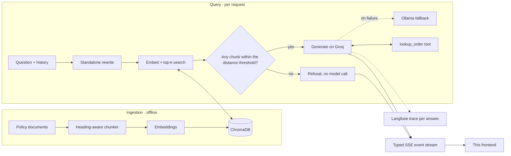

# QuickBite Support

**A retrieval-augmented customer support agent for a food delivery app, with a frontend that shows its work.**

It answers refund, delivery, and order questions from 26 policy documents and live order data. It refuses when nothing
in the knowledge base is close enough to the question. And every answer can be taken apart: the chunks it retrieved
and their distances, which ones it actually cited, the tool calls it made, where the milliseconds went, and what it
cost.

**Live demo → [quickbite-support.vercel.app](https://quickbite-support.vercel.app)**

The demo runs on a mock backend that implements the same streaming API contract as the Python service. It works
even when that service is asleep, and the header says so honestly ("Demo mode").

<!--
Screenshots to add (docs/media/):
  answer-inspector.png   Answer with citation chips and the inspector open
  refusal.png            Refusal card with the closest non-qualifying match
  order-card.png         lookup_order result rendered as an order card
  how-it-works.png       Architecture walkthrough and evals dashboard
  replay.gif             A recorded session streaming, ~10 seconds
-->

| Screen                                  | Placeholder                       |
| --------------------------------------- | --------------------------------- |
| Answer with citations and the inspector | `docs/media/answer-inspector.png` |
| Refusal with the nearest miss           | `docs/media/refusal.png`          |
| Order lookup card                       | `docs/media/order-card.png`       |
| Architecture and evals                  | `docs/media/how-it-works.png`     |
| Recorded session streaming              | `docs/media/replay.gif`           |

---

## A 60-second tour

1. **Watch a recorded session.** A three-turn conversation streams through the real pipeline:
   - an order lookup
   - a follow-up rewritten into a standalone query before retrieval
   - a final answer served by the Ollama fallback after Groq rate-limits
2. **Hover a citation chip**, then click it. The source panel shows the full chunk, the policy document, and its similarity distance.
3. **Ask something out of scope**, e.g. _"How much do QuickBite delivery partners earn per order?"_ You get a refusal card, not a guess, with the closest non-qualifying match and its score.
4. **Press `Ctrl/⌘ + .`** to open the inspector:
   - ranked chunks plotted against the refusal threshold
   - a latency waterfall (embed → retrieve → filter → generate, with tool calls in between)
   - token counts, estimated cost, and the trace id
5. **Open "How it works"** for the architecture walkthrough and the eval results.
6. **Break it on purpose.** Add `?mock_failure=mid_stream` (or `network`, `rate_limited`, `upstream_unavailable`) to the URL and watch the error states keep partial answers and offer a retry.

## Architecture



The frontend and backend meet at one documented contract: [`docs/API_CONTRACT.md`](docs/API_CONTRACT.md).

`POST /chat` streams typed server-sent events, and each one is validated with Zod on arrival:

- `message.start`, `status`, `retrieval`
- `message.delta`, `citation`
- `tool_call.start`, `tool_call.result`
- `refusal`, `message.end`, `error`

## Engineering decisions and trade-offs

**Why ChromaDB.** It is embedded and zero-ops, and it is more than fast enough for a corpus of a few dozen policy
documents. A managed vector database would add network latency, cost, and another service to keep alive without
changing retrieval quality at this scale. If the knowledge base grew by orders of magnitude or needed multi-tenant
filtering, that trade would flip.

**Why Groq with an Ollama fallback.** Groq gives a fast first token, which is most of what "feels responsive" in a
chat product. Its free tier rate-limits, though, and a support agent that errors under load is worse than one that
is a bit slower. When Groq fails, the same prompt is retried on a self-hosted Ollama model, and the response metadata
records that it happened. The inspector shows a "Fallback served" badge and the slower generation span, so the
degradation is visible rather than silent.

**Why a distance-threshold refusal.** If no retrieved chunk is within the threshold, the pipeline returns a refusal
carrying the nearest miss and **never calls the language model**. That makes out-of-scope handling:

- deterministic
- free, since no tokens are spent
- immune to hallucination

The cost is the occasional false refusal of an oddly phrased in-scope question. That is measured rather than
guessed: the eval set includes out-of-scope questions and counts false refusals, so the threshold is tuned on data.
The refusal is designed as a first-class answer, not styled as an error.

**What the eval harness measured, and what changed.** A golden set of support questions is scored for faithfulness,
answer relevancy, context precision, and context recall. The clearest result: **cutting top-k from 5 to 3 raised
context precision from 0.54 to 0.64**. Fewer, closer chunks meant less distracting context for the model. Context
recall is the metric to watch for the opposite failure, where an answer needs a fourth chunk it no longer gets. The
dashboard in the app renders the full runs from [`src/data/evals.json`](src/data/evals.json). Numbers other than the
precision change are placeholders until the latest run is published, and the dashboard labels them as such.

**Contract first, backend second.** The frontend defined the API it needed, as Zod schemas with field priorities
(required, recommended, nice-to-have). Missing optional data hides a UI section instead of breaking it. The mock
backend implements the contract and validates its own output. `pnpm contract:verify` sends every scenario through
real SSE framing and a socket, and checks the result is identical to the mock's direct output. Going live is an
environment variable, not a refactor.

**The mock is a product feature, not a stub.** It is a real, if small, retriever: field-weighted term scoring shaped
to produce plausible cosine distances, with the same refusal threshold. Ask it something the scripts never
anticipated and it retrieves, cites, or refuses on its own. Tokens arrive in uneven bursts with occasional stalls,
because a metronome is the tell of a fake stream. The latencies it reports are the durations it actually waited.

**Resilience that stays honest.** In live mode, any failure before an answer starts is handed to the fixture-backed
mock:

- network, CORS, and timeouts
- 429 rate limits
- 5xx errors, including the model being unavailable

A banner reads _"Live backend unavailable — replaying recorded sessions"_ and answers are tagged **Recorded**. Failures
after an answer has started never fall back, because splicing two answers together would be worse. Those keep the
partial text and offer a retry.

**Streaming without jank.** Events are applied once per animation frame rather than once per token, and
persistence to localStorage is throttled and serialised lazily. A fast stream costs one render per frame and lands
smoothly. In a background tab, where animation frames stop, events apply immediately instead.

**Accessibility.**

- A screen-reader live region announces pipeline phases and the finished answer, never individual tokens.
- Drawers and sheets are focus-trapped dialogs.
- Every control is keyboard reachable with a visible focus ring.
- Motion respects `prefers-reduced-motion` throughout.
- Colour tokens are checked for AA contrast.

## Repository tour

```text
src/
  app/                     Routes: / (the product), /styleguide, Open Graph image
  components/
    chat/                  Thread, streaming markdown with citation chips, order card, refusal card, composer
    inspector/             Distance scale, ranked chunks, latency waterfall, model & cost, trace
    how-it-works/          Architecture walkthrough (hand-built SVG) and evals dashboard
    app/                   Shell, header status badge, history rail, fallback banner, error boundary
    ui/                    Primitives and the Aceternity components, rethemed against the design tokens
  lib/
    api/                   Contract (Zod), ChatClient interface, HttpChatClient, SSE decoder,
                           resilient live→replay client, stream conformance checker, mock backend
    chat/                  Event reducer and the persisted conversation store
    fixtures/              26 policy documents (57 chunks), order records, 5 scripted conversations
  data/evals.json          Eval results rendered by the dashboard
docs/
  API_CONTRACT.md          The backend spec: events, grammar, refusals, tools, observability, health
  INTEGRATION.md           Going live: env vars, CORS, SSE through proxies, wiring checklist
  contract/*.schema.json   JSON Schemas generated from the Zod contract
scripts/contract.ts        export · check · verify · serve, with zero dependencies
```

The design system lives at **`/styleguide`**:

- colour tokens in both themes
- the type pairing (Fraunces display, Instrument Sans body, JetBrains Mono for numbers)
- every primitive
- each Aceternity component, with what changed in its retheme

## Run it locally

Requires Node 20+ and pnpm (via `corepack enable`).

```bash
pnpm install
pnpm dev
```

Open http://localhost:3000. With no environment variables set, it runs in demo mode.

| Variable                           | Default    | Purpose                                                      |
| ---------------------------------- | ---------- | ------------------------------------------------------------ |
| `NEXT_PUBLIC_API_MODE`             | `mock`     | `live` talks to the backend at `NEXT_PUBLIC_API_URL`.        |
| `NEXT_PUBLIC_API_URL`              | —          | Backend base URL. May include a path prefix.                 |
| `NEXT_PUBLIC_MOCK_PROFILE`         | `demo`     | `realistic` adds a cold start and occasional model fallback. |
| `NEXT_PUBLIC_LANGFUSE_PROJECT_URL` | —          | Builds trace deep links from `trace_id`.                     |
| `NEXT_PUBLIC_SITE_URL`             | Vercel URL | Canonical URL for social previews.                           |

| Command                                           | What it does                                                                                                              |
| ------------------------------------------------- | ------------------------------------------------------------------------------------------------------------------------- |
| `pnpm verify`                                     | Typecheck, lint, contract suite, and the SSE round-trip check.                                                            |
| `pnpm contract:check`                             | Runs every scripted turn, improvised questions, and failure modes through the mock; validates schemas and stream grammar. |
| `pnpm contract:check --url http://localhost:8000` | The same checks against a real backend, plus an optional-field coverage report.                                           |
| `pnpm contract:serve`                             | A reference SSE server implementing the contract.                                                                         |
| `pnpm contract:export`                            | Regenerates `docs/contract/*.schema.json`.                                                                                |

## Connecting the real backend

Set `NEXT_PUBLIC_API_MODE=live` and `NEXT_PUBLIC_API_URL`, then redeploy. [`docs/INTEGRATION.md`](docs/INTEGRATION.md)
covers:

- the CORS configuration
- how to confirm your host is not buffering the event stream
- health checks and cold starts
- a field-by-field wiring checklist

## Stack

Next.js 16 (App Router) · React 19 · TypeScript (strict) · Tailwind CSS v4 · Motion · Zustand · Zod · Base UI ·
react-markdown · lucide · Aceternity UI (Sidebar, Timeline, Tracing Beam, Animated Tooltip, Bento Grid, Card Hover
Effect, Moving Border, Infinite Moving Cards, Spotlight), each rethemed to the design tokens.
